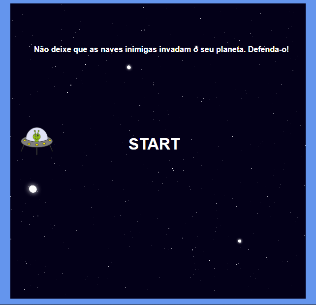

# **Criando seu jogo no estilo Space Shooter**

## Projeto do Bootcamp JavaScript Game Developer na plataforma [Digital Innovation One](https://digitalinnovation.one/sign-up)

### Ministrado por: [Gabriela Pinheiro](https://www.linkedin.com/in/gabrielapinheiro129/)

### **Objetivo**
Criar um Space Shooter utilizando HTML5, CSS3 e JavaScript.

### **Conceitos Abordados**
- Lógica de programação utilizando posicionamento com CSS3.
- Manipulação de Array.
- Manipulação de DOM.
- EventListeners. 

### **Tecnologias Utilizadas**
- Visual Studio Code:
    - Live Server.
- Navegador.

### **Resultado Final**

